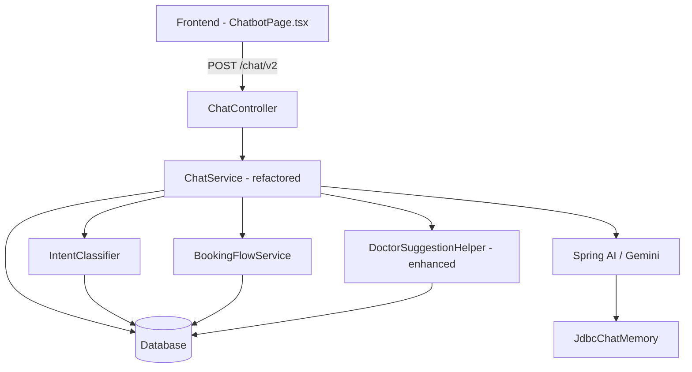

# Design Document: AI Chatbot Upgrade

## Overview

Hệ thống chatbot AI hiện tại của KimQuy Health Connect đã có nền tảng tốt (Spring AI, ChatMemory, intent detection, booking flow) nhưng còn nhiều điểm yếu:

- Intent detection dùng keyword cứng, dễ bỏ sót câu hỏi tự nhiên
- Frontend render tin nhắn dạng plain text (không parse Markdown)
- Không có typing indicator
- Symptom-to-specialty mapping bị phân tán ở nhiều nơi (ChatService, DoctorSuggestionHelper, frontend)
- BookingSession lưu in-memory (mất khi restart)
- SystemPrompt chưa inject dữ liệu thực từ DB (danh sách chuyên khoa, bác sĩ)
- ChatIntentService tồn tại nhưng không được dùng (logic nằm hết trong ChatService)

Mục tiêu thiết kế: refactor và nâng cấp toàn diện để đạt chuẩn AI Concierge y tế chuyên nghiệp.

---

## Architecture



**Luồng xử lý chính:**
1. Frontend gửi `{ message, userId, conversationId }` lên `POST /chat/v2`
2. `ChatService.chat()` gọi `IntentClassifier.classify()` để xác định intent
3. Dựa vào intent, dispatch sang handler tương ứng
4. Handler truy vấn DB lấy dữ liệu thực, build context, gọi AI nếu cần
5. Trả về response dạng Markdown
6. Frontend render Markdown bằng `react-markdown`

---

## Components and Interfaces

### Backend

#### IntentClassifier (mới - tách từ ChatService)
```java
public class IntentClassifier {
    public IntentResult classify(String message);
    // Trả về: SUGGEST_DOCTOR, CHECK_SCHEDULE, BOOKING, CONFIRM_BOOKING,
    //         CANCEL_BOOKING, VIEW_APPOINTMENTS, HOSPITAL_INFO, MEDICAL_ADVICE
}
```
- Dùng normalized text (bỏ dấu, lowercase) để match
- Ưu tiên context: nếu có BookingSession đang chờ → ưu tiên CONFIRM_BOOKING
- Fallback về MEDICAL_ADVICE nếu không match

#### BookingFlowService (tách từ ChatService)
```java
public class BookingFlowService {
    public String startBooking(String doctorName, UUID userId, String originalMessage);
    public String confirmBooking(UUID userId, String userMessage);
    public String cancelBooking(UUID userId);
    public boolean hasActiveSession(UUID userId);
}
```
- BookingSession vẫn lưu in-memory (ConcurrentHashMap) — đủ cho scope hiện tại
- Thêm TTL 30 phút để tự xóa session hết hạn

#### ChatService (refactored)
- Giữ vai trò orchestrator
- Inject dữ liệu DB vào SystemPrompt khi gọi AI (danh sách chuyên khoa, top bác sĩ)
- Xử lý retry logic khi AI call thất bại

#### DoctorSuggestionHelper (enhanced)
- Hợp nhất symptom map từ ChatService vào đây (single source of truth)
- Thêm method `buildDoctorListMarkdown(List<Doctor>)` để format output nhất quán

### Frontend

#### ChatbotPage.tsx (refactored)
- Thêm `react-markdown` + `remark-gfm` để render Markdown
- Thêm TypingIndicator component (3 chấm nhảy)
- Tách `MessageBubble` thành component riêng
- Giữ nguyên quick prompts, image upload, conversation ID logic

#### MessageBubble component (mới)
```tsx
interface MessageBubbleProps {
  role: 'user' | 'bot';
  text: string;
  time: string;
}
```
- Bot messages: render qua `react-markdown`
- User messages: render plain text

---

## Data Models

### Entities hiện có (không thay đổi schema)
- `Doctor`: id, fullName, degree, specialty, clinicFee, bio, experienceYears
- `Specialty`: id, name
- `Schedule`: id, doctorId, workDate, startTime, endTime, maxPatient
- `Appointment`: id, patientId, doctorId, appointmentDate, startTime, endTime, status, reason
- `Patient`: id, userId, fullName

### BookingSession (in-memory, không persist)
```java
class BookingSession {
    UUID doctorId;
    String doctorName;
    UUID patientId;
    String originalMessage;
    String step;           // WAITING_DATE | WAITING_TIME | READY
    LocalDateTime createdAt; // để TTL cleanup
}
```

### ChatRequest DTO (hiện có)
```java
record ChatRequest(String message, UUID userId, String conversationId) {}
```

---

## Correctness Properties

*A property is a characteristic or behavior that should hold true across all valid executions of a system — essentially, a formal statement about what the system should do. Properties serve as the bridge between human-readable specifications and machine-verifiable correctness guarantees.*

### Property 1: Intent classification completeness
*For any* non-empty, non-whitespace message string, `IntentClassifier.classify()` SHALL return a non-null `IntentResult` with a non-null, non-empty intent string belonging to the set {SUGGEST_DOCTOR, CHECK_SCHEDULE, BOOKING, CONFIRM_BOOKING, CANCEL_BOOKING, VIEW_APPOINTMENTS, HOSPITAL_INFO, MEDICAL_ADVICE}.

**Validates: Requirements 1.1, 1.4**

### Property 2: Symptom-to-specialty mapping consistency
*For any* message containing a known symptom keyword (e.g., "đau đầu", "ho", "đau bụng"), `IntentClassifier.classify()` SHALL return intent SUGGEST_DOCTOR or MEDICAL_ADVICE, and `DoctorSuggestionHelper.mapSymptomToSpecialty()` SHALL return a non-null specialty name.

**Validates: Requirements 1.2, 2.1**

### Property 3: Doctor list non-empty fallback
*For any* specialty name query, `DoctorSuggestionHelper.suggestDoctorsBySpecialty()` SHALL return a non-empty list (falling back to top-rated doctors if no specialty match found).

**Validates: Requirements 2.2, 2.4**

### Property 4: Doctor suggestion output completeness
*For any* non-empty list of Doctor entities, `DoctorSuggestionHelper.buildDoctorListMarkdown()` SHALL return a string containing each doctor's fullName, specialty name, and clinicFee.

**Validates: Requirements 2.3**

### Property 5: Booking requires authentication
*For any* booking request where userId is null, `BookingFlowService.startBooking()` SHALL return a response string containing the Vietnamese word "đăng nhập" (login prompt).

**Validates: Requirements 4.1**

### Property 6: BookingSession TTL cleanup
*For any* BookingSession created more than 30 minutes ago, `BookingFlowService.hasActiveSession()` SHALL return false after the TTL cleanup runs.

**Validates: Requirements 7.4**

### Property 7: Empty/whitespace message rejection
*For any* message string that is null, empty, or composed entirely of whitespace characters, `ChatService.chat()` SHALL return a non-empty guidance string without calling the AI model.

**Validates: Requirements 7.3**

### Property 8: Markdown rendering correctness
*For any* bot response string containing Markdown bold syntax (`**text**`), the rendered HTML output from `MessageBubble` SHALL contain a `<strong>` element with the corresponding text content.

**Validates: Requirements 6.1**

### Property 9: Schedule availability filter
*For any* Schedule entity where `bookedCount >= maxPatient`, that schedule SHALL NOT appear in the available slots returned by `handleCheckSchedule()`.

**Validates: Requirements 3.2**

---

## Error Handling

| Scenario | Behavior |
|---|---|
| AI model unreachable | Retry 1 lần, sau đó trả về fallback message thân thiện + hotline |
| DB query fails | Log lỗi, trả về message không tiết lộ stack trace |
| Doctor not found | Thông báo rõ ràng + gợi ý "Gợi ý bác sĩ" |
| BookingSession expired | Thông báo + hướng dẫn bắt đầu lại |
| Appointment conflict | Thông báo + gợi ý xem lịch rảnh |
| Schedule full | Thông báo + gợi ý bác sĩ khác |
| Unauthenticated booking | Redirect đến đăng nhập |
| Empty message | Trả về guidance string, không gọi AI |

---

## Testing Strategy

### Unit Testing
- Test `IntentClassifier.classify()` với các câu tiếng Việt tự nhiên (có dấu, không dấu, viết tắt)
- Test `DoctorSuggestionHelper.mapSymptomToSpecialty()` với các triệu chứng phổ biến
- Test `extractDate()` và `extractTime()` với các định dạng ngày giờ khác nhau
- Test `BookingFlowService` với các trạng thái session khác nhau
- Test `MessageBubble` render Markdown đúng

### Property-Based Testing
Sử dụng **jqwik** (Java) cho backend và **fast-check** (TypeScript) cho frontend.

Mỗi property-based test chạy tối thiểu **100 iterations**.

Mỗi test được annotate với comment:
`// Feature: ai-chatbot-upgrade, Property {N}: {property_text}`

**Backend (jqwik):**
- Property 1: Intent classification completeness — generate random non-empty strings
- Property 2: Symptom mapping consistency — generate strings containing known symptom keywords
- Property 3: Doctor list non-empty fallback — generate random specialty name strings
- Property 4: Doctor suggestion output completeness — generate random Doctor lists
- Property 5: Booking requires authentication — generate booking requests with null userId
- Property 6: BookingSession TTL — generate sessions with timestamps > 30 min ago
- Property 7: Empty message rejection — generate null/empty/whitespace strings

**Frontend (fast-check):**
- Property 8: Markdown rendering — generate strings with `**bold**` patterns, verify `<strong>` in output
- Property 9: Schedule availability filter — generate Schedule + Appointment counts, verify filter logic
